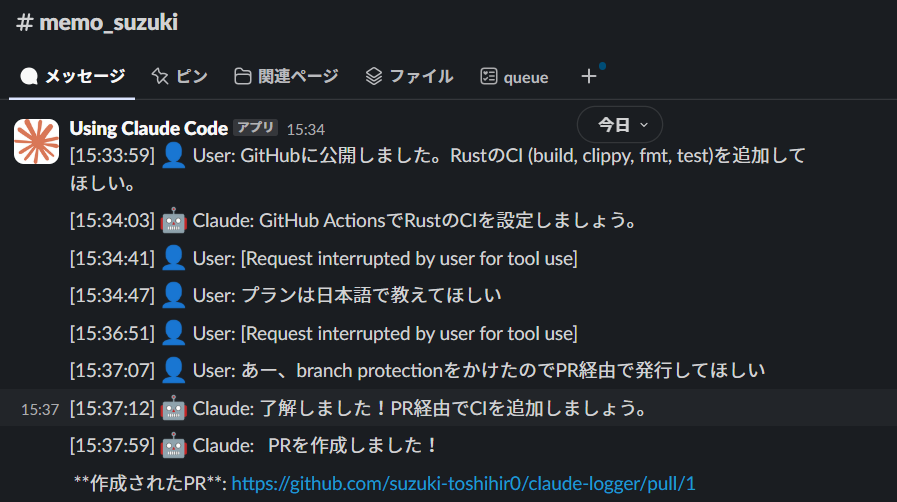

# Claude Logger


***<span style="font-size: 140%">Work Out Loud with your Claude Code!</span>***

Real-time monitoring tool for Claude Code conversations. Watches JSONL log files and streams formatted messages to stdout with optional webhook integration.



## Features

- 🔍 **Real-time monitoring** of Claude Code JSONL logs
- 🔧 **Tool display modes** - hide, simplify, or detail tool usage
- 🔔 **Webhook integration** - send messages to Slack or custom endpoints

## Installation

```bash
cargo install claude-logger
```

Or build from source:
```bash
git clone git@github.com:suzuki-toshihir0/claude-logger.git
cd claude-logger
cargo build --release
```

## Usage

### Monitor latest project
```bash
# First, start Claude Code in your project
claude

# Then start the logger in another terminal
claude-logger watch --latest
```

### Webhook Integration
Send messages to external services:
```bash
# Slack webhook
claude-logger watch --latest \
  --webhook-url https://hooks.slack.com/services/YOUR/WEBHOOK/URL \
  --webhook-format slack
```

## Advanced Options

### Tool Display Modes
Control how tool usage is displayed:
```bash
# Hide all tool usage (default: simple)
claude-logger watch --latest --tool-display none

# Show simple indicators like "🔧 Bash"
claude-logger watch --latest --tool-display simple

# Show detailed tool usage
claude-logger watch --latest --tool-display detailed
```

### Include Historical Messages
By default, only new messages are shown. To include existing messages:
```bash
claude-logger watch --latest --include-existing
```

## Output Format

Messages are displayed with timestamps and role indicators:

```
[14:23:15] 👤 User: Help me implement a file watcher in Rust
[14:23:18] 🤖 Claude: I'll help you create a file watcher in Rust...
[14:23:20] 🤖 Claude: 🔧 Write
[14:23:22] 🤖 Claude: ✅ Result
```

## Troubleshooting

### Wrong project being monitored
This is the most common issue and usually occurs when claude-logger is started before Claude Code.

**Solution**:
1. **Start Claude Code first**: Run `claude` in your project directory
2. **Then start claude-logger**: Run `claude-logger watch --latest` in another terminal

